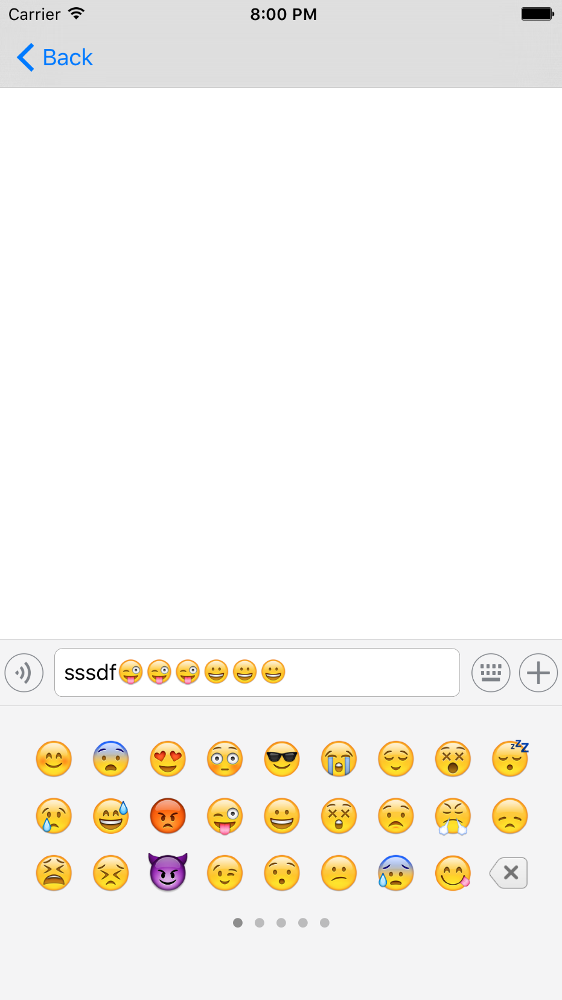
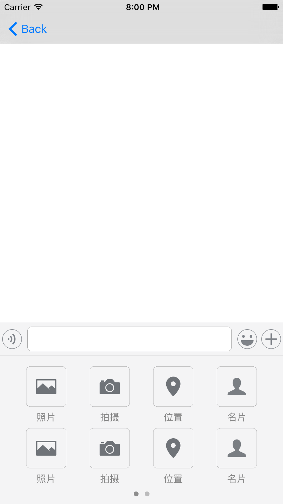

# DTMessageInputToolBar
模仿微信聊天输入工具条

## 如何使用

下载代码，拖入工程，在需要的 ViewController 加入如下代码：

	#improt "DTMessageInputToolBar.h"
	DTMessageInputToolBar *inputToolBar = [[DTMessageInputToolBar alloc] initWithFrame:CGRectMake(0, 	self.view.frame.size.height - DT_INPUTVIEW_HEIGHT, self.view.frame.size.width, self.view.frame.size.height)];
    inputToolBar.delegate = self;
    [self.view addSubview:inputToolBar];
实现 DTMesaageInputToolBarDelegate 协议

	/**
	 *  录音时各状态切换
	 *
	 *  @param state 录音状态
	 */
	- (void)didRecordVoiceWithState:(DTMessageInputToolBarRecordVoiceState)state;

	/**
 	 *  开始输入
 	 *
	 *  @param textView 输入文本框
	 */
	- (void)inputTextViewDidBeginEditing:(DTTextView *)textView;

	/**
	 *  结束输入
	 *
	 *  @param textView 输入文本框
	 */
	- (void)inputTextViewDidEndEditing:(DTTextView *)textView;

	/**
	 *  文本框高度变化
	 *
 	*  @param textView 输入文本框
 	*  @param height   变化的高度
	 */
	- (void)inputTextView:(DTTextView *)textView didChangeHeight:(float)height;

	/**
	 *  插件点击事件
	 *
 	 *  @param pluginView 点击的插件对象
	 *  @param index      点击的插件位置
	 */
	- (void)pluginView:(DTPluginItem *)pluginItem didSelectItemAtIndex:(NSInteger)index;
	
##截图
   

##未完待续...